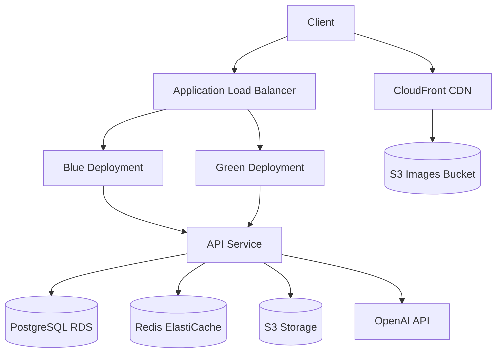

# Tarot API

[](https://github.com/abdul-hamid-achik/tarot-api/actions/workflows/ci.yml)
[](https://github.com/abdul-hamid-achik/tarot-api/actions/workflows/pulumi-deploy.yml)
[](https://github.com/abdul-hamid-achik/tarot-api/actions/workflows/preview-environments.yml)
[](https://github.com/abdul-hamid-achik/tarot-api/actions/workflows/security-scan.yml)
[](https://github.com/abdul-hamid-achik/tarot-api/actions/workflows/cleanup-previews.yml)


A Ruby on Rails API for tarot card reading and interpretation, leveraging OpenAI technologies.

## Table of Contents
- [Quick Start](#quick-start)
- [Overview](#overview)
- [Infrastructure](#infrastructure)
- [Development](#development)
- [Deployment](#deployment)
- [API Documentation](#api-documentation)
- [Command Reference](#command-reference)
- [Contributing](#contributing)
- [Troubleshooting](#troubleshooting)
- [License](#license)

## Quick Start

Get up and running in minutes:

```bash
# Clone the repository
git clone https://github.com/abdul-hamid-achik/tarot-api.git
cd tarot-api

# Install dependencies
bundle install

# Copy and configure environment variables
cp .env.example .env

# Set up the development environment with Docker
bundle exec rake dev:setup

# Start the API server
bundle exec rake dev

# Visit the API at http://localhost:3000
# API documentation at http://localhost:3000/docs
```

## Overview

this api provides endpoints for tarot card readings, user management, and ai-powered interpretations. it is designed to be scalable, secure, and user-friendly.

## Infrastructure

this project uses aws infrastructure deployed via pulumi to provide a scalable, reliable application environment.

### technology stack

- **ruby on rails 8**: a web-application framework that includes everything needed to create database-backed web applications according to the model-view-controller (mvc) pattern.
- **postgresql**: a powerful, open source object-relational database system.
- **redis**: an in-memory data structure store, used as a database, cache, and message broker.
- **docker**: for containerization and consistent environments across development, staging, and production.
- **pulumi**: infrastructure as code tool for aws resource provisioning.
- **kamal**: zero-downtime container deployments using docker and traefik.
- **aws**: cloud infrastructure provider (ecs, rds, elasticache, s3, cloudfront, route53).

### system architecture

the application follows a microservices architecture with:

- web api layer handling http requests
- business logic layer implementing core functionality
- data persistence layer for storage
- background job processing for async tasks
- ai integration layer for openai/llm interactions



### infrastructure as code (pulumi)

this project uses pulumi for infrastructure provisioning. the infrastructure is defined in the `infra/pulumi` directory with yaml configuration files:

- `Pulumi.yaml` - main project configuration
- `network.yaml` - vpc, subnets, security groups
- `database.yaml` - rds instance for postgresql
- `cache.yaml` - elasticache for redis
- `storage.yaml` - s3 buckets and cloudfront cdn
- `dns.yaml` - route53 for domain management
- `ecs.yaml` - container orchestration and load balancing

### pulumi state management

The project uses Pulumi Cloud for state management. Your Pulumi access token is automatically used when running infrastructure commands.

If you need to log in manually:

```sh
pulumi login
```

it's recommended to periodically backup your pulumi state:

```sh
# backup all stacks
bundle exec rake pulumi:backup_state

# restore from backup
bundle exec rake pulumi:restore_state[backup_file.tar.gz]
```

### environments

the project supports multiple deployment environments with their own domains:

- **production**: https://tarotapi.cards
- **staging**: https://staging.tarotapi.cards
- **preview**: https://preview-{feature-name}.tarotapi.cards

all environments are subdomains of tarotapi.cards:

```
# production
tarotapi.cards
cdn.tarotapi.cards

# staging
staging.tarotapi.cards
cdn-staging.tarotapi.cards

# preview environments
preview-my-feature.tarotapi.cards
cdn-preview-my-feature.tarotapi.cards
```

### deployment workflow

deployments are handled via github actions workflows:

1. **staging deployment**: automatically triggered when code is merged to the main branch
2. **preview environments**: created when a branch is tagged with `preview-*`
3. **production deployment**: triggered when a version tag (`v*`) is created or through manual approval

#### github actions integration

the infrastructure is automatically deployed via github actions workflows:

- `pulumi-deploy.yml`: handles deployments to staging and production
- `cleanup-previews.yml`: cleans up inactive preview environments

### zero-downtime deployments

the system uses blue-green deployment strategy for zero-downtime updates:

1. new version (green) is deployed alongside the existing version (blue)
2. health checks verify the new version is healthy
3. traffic is gradually shifted from blue to green
4. once all traffic is on green, blue can be updated for the next deployment

### cost optimization

the infrastructure includes several cost-saving measures:

- staging and preview environments scale down to zero during non-business hours
- resource sizes are optimized for each environment
- preview environments are automatically cleaned up when inactive for more than 3 days

### domain management

the domain `tarotapi.cards` is managed through aws route53:

- domain registration is handled via rake task: `rake pulumi:register_domain`
- domain protection is enabled to prevent accidental deletion: `rake pulumi:protect_domain`
- ssl certificates are automatically provisioned and renewed

### getting started with infrastructure

#### prerequisites

- aws account with appropriate permissions
- aws cli installed and configured with appropriate credentials
- pulumi cli installed (`brew install pulumi` or visit [pulumi.com](https://www.pulumi.com/docs/install/))
- ruby 3.4+
- appropriate github secrets for github actions workflows

#### initial setup

1. initialize the pulumi project:

```sh
bundle exec rake pulumi:init
```

this command will:
- bootstrap an s3 bucket (`tarotapi-pulumi-state`) for pulumi state storage
- configure pulumi to use this bucket as the backend
- create stacks for all environments (production, staging, preview)
- set up initial configuration for each stack

2. set up secrets for your environment:

```sh
bundle exec rake pulumi:set_secrets[staging]
```

3. deploy the infrastructure:

```sh
bundle exec rake pulumi:deploy[staging]
```

#### common tasks

create a preview environment:

```sh
bundle exec rake pulumi:create_preview[feature-name]
```

list all preview environments:

```sh
bundle exec rake pulumi:list_previews
```

deploy to production (with confirmation):

```sh
bundle exec rake pulumi:deploy_production
```

cleanup inactive preview environments:

```sh
bundle exec rake pulumi:cleanup_previews
```

view infrastructure outputs:

```sh
bundle exec rake pulumi:info[environment]
```

register the domain:

```sh
bundle exec rake pulumi:register_domain
```

protect the domain from accidental deletion:

```sh
bundle exec rake pulumi:protect_domain
```

## Development

### prerequisites

- ruby 3.4.0
- postgresql 16
- redis 7
- docker and docker compose
- node.js and yarn

### setup

1. clone the repository
```bash
git clone https://github.com/abdul-hamid-achik/tarot-api.git
cd tarot-api
```

2. install dependencies
```bash
bundle install
```

3. setup environment variables
```bash
cp .env.example .env
```
edit `.env` with your configuration

4. setup development environment
```bash
bundle exec rake dev:setup
```

5. start the server
```bash
bundle exec rake dev
```

### common development tasks

```bash
# start development environment with docker
bundle exec rake dev

# open rails console
bundle exec rake dev:console

# run tests
bundle exec rake dev:test

# view logs
bundle exec rake dev:logs

# rebuild all containers
bundle exec rake dev:rebuild
```

### running tests

```bash
bundle exec rails test
# or
bundle exec rspec
# or
bundle exec cucumber
```

### linting and style

```bash
bundle exec rubocop
```

## Deployment

this project can be deployed to aws using pulumi for infrastructure as code:

### prerequisites

1. aws account and credentials
2. docker registry access
3. pulumi installed (`gem install pulumi`)
4. ssh access to deployment servers

### deployment commands

```bash
# set up servers for deployment
bundle exec rake deploy:setup

# deploy to staging
bundle exec rake deploy

# deploy to production
bundle exec rake deploy:production

# deploy a preview environment
bundle exec rake deploy:preview[branch-name]

# check deployment status
bundle exec rake deploy:status

# destroy an environment
bundle exec rake deploy:destroy[environment-name]
```

### dependabot configuration

the project is configured with special handling for dependabot pull requests:

- preview environments are not created for dependabot prs
- ci runs limited tests for dependabot prs (only security and linting checks)
- full test suites are skipped for dependabot to speed up dependency updates
- minor and patch updates are automatically merged when ci passes
- major version updates require manual review

configuration:
- `.github/dependabot.yml`: controls update frequency and versioning strategy
- `.github/workflows/dependabot-auto-merge.yml`: handles auto-merging of safe updates

this helps reduce infrastructure costs and ci pipeline usage while still maintaining security checks.

### data management

```bash
# seed database with tarot card data
bundle exec rake seed

# backup database
bundle exec rake data:backup

# restore from backup
bundle exec rake data:restore[filename]

# analyze database performance
bundle exec rake data:analyze
```

## API Documentation

The API follows JSONapi specification. Full OpenAPI documentation is available at `/api-docs`.

### Authentication Methods

The API supports three authentication methods:

1. **JWT Bearer Token**
```bash
# Register a new user
curl -X POST \
  "https://api.tarotapi.cards/api/v1/auth/register" \
  -H "Content-Type: application/json" \
  -d '{"email": "abdulachik@icloud.com", "password": "securepassword"}'

# Login to get JWT token
curl -X POST \
  "https://api.tarotapi.cards/api/v1/auth/login" \
  -H "Content-Type: application/json" \
  -d '{"email": "abdulachik@icloud.com", "password": "securepassword"}'
```

2. **HTTP Basic Authentication**
```bash
curl -X GET \
  "https://api.tarotapi.cards/api/v1/cards" \
  -H "Authorization: Basic $(echo -n 'abdulachik@icloud.com:password' | base64)"
```

3. **API Key Authentication**
```bash
curl -X GET \
  "https://api.tarotapi.cards/api/v1/cards" \
  -H "X-API-Key: your-api-key"
```

### Key Endpoints

| Endpoint | Description | Authentication Required |
|----------|-------------|-------------------------|
| `GET /api/v1/cards` | List all tarot cards | No |
| `GET /api/v1/spreads` | List available spreads | No |
| `POST /api/v1/readings` | Create a new reading | Yes |
| `GET /api/v1/readings/{id}` | Get a specific reading | Yes |

## Command Reference

### Infrastructure Management

| Command | Description |
|---------|-------------|
| `bundle exec rake pulumi:init_all` | Initialize infrastructure for staging and production |
| `bundle exec rake pulumi:deploy[staging]` | Deploy to staging environment |
| `bundle exec rake pulumi:deploy_all` | Deploy to staging, then gradually to production |
| `bundle exec rake pulumi:create_preview[feature]` | Create preview environment |
| `bundle exec rake pulumi:cleanup_previews` | Clean up inactive preview environments |

### Development Commands

| Command | Description |
|---------|-------------|
| `bundle exec rake dev:setup` | Set up development environment |
| `bundle exec rake dev`

### Complete Environment Setup Sequence

1. Initialize Pulumi and create state bucket:
   ```bash
   bundle exec rake pulumi:init
   ```

2. Set up secrets for each environment:
   ```bash
   bundle exec rake pulumi:set_secrets[staging]
   bundle exec rake pulumi:set_secrets[production]
   ```

3. Deploy infrastructure:
   ```bash
   # Deploy staging first
   bundle exec rake pulumi:deploy[staging]
   
   # Once staging is verified, deploy production
   bundle exec rake pulumi:deploy[production]
   ```

4. Deploy application:
   ```bash
   bundle exec rake deploy:app:staging
   bundle exec rake deploy:app:production
   ```

### Local Workflow Testing with Act

We use [Act](https://github.com/nektos/act) to test GitHub Actions workflows locally. Our setup uses the development stage from our main `Dockerfile`.

Prerequisites:
- Docker running
- PostgreSQL running on port 5432
- Redis running on port 6379
- `.env` file with required variables

```bash
# Build the CI image (required once)
bundle exec rake ci:build_image

# Run all CI checks
bundle exec rake ci:all

# Run specific checks
bundle exec rake ci:lint  # Run linting
bundle exec rake ci:test  # Run tests
bundle exec rake ci:docs  # Generate docs
```

Common issues:
- Database errors: Check PostgreSQL is running (`docker ps`)
- Redis errors: Check Redis is running (`docker ps`)
- Build errors: Try rebuilding the CI image

For more details on Act, see the [official documentation](https://github.com/nektos/act#readme).

### Preview Environment Management

Preview environments are temporary deployments for feature testing:

- **Creation Methods**:
  1. Branch naming: Create a branch with `preview-*` prefix
  2. PR tagging: Add `preview` label to a PR
  3. Manual trigger: Use GitHub Actions workflow dispatch

- **Access Control**:
  - Only repository owner (@abdul-hamid-achik) can create preview environments
  - Dependabot PRs do not create preview environments
  - Preview URLs follow pattern: `https://preview-{feature-name}.tarotapi.cards`

- **Lifecycle**:
  - Created automatically on PR open or preview tag
  - Updated on PR synchronize
  - Cleaned up automatically:
    - When PR is closed
    - After 3 days of inactivity
    - When preview tag is removed
  - Can be recreated using `bundle exec rake deploy:preview[name]`

### Deployment Verification

After deploying to any environment, verify the setup:

1. Check infrastructure status:
   ```bash
   bundle exec rake deploy:status[environment]
   ```

2. Verify domain and SSL setup:
   ```bash
   bundle exec rake deploy:verify_ssl[environment]
   ```

3. Monitor application logs:
   ```bash
   bundle exec rake deploy:logs[environment]
   ```