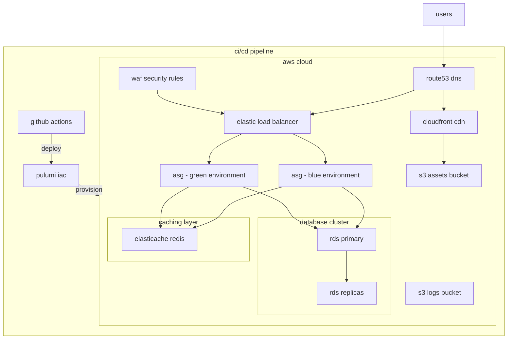

# tarot api

a rails api for tarot card readings and interpretations.

## overview

the tarot api provides a robust backend for tarot card readings, interpretations, and spreads. it's built with rails and follows modern web api practices, including json serialization, authentication, and comprehensive testing.

## deployment and architecture

this project uses aws infrastructure deployed via pulumi to provide a scalable, reliable application environment.

### infrastructure components



### pulumi infrastructure setup

the project uses pulumi for infrastructure as code, with configuration stored in the `./infrastructure` directory using yaml configuration:

```
infrastructure/
├── Pulumi.yaml               # main project configuration
├── Pulumi.staging.yaml       # staging environment config
├── Pulumi.production.yaml    # production environment config
├── Pulumi.preview.yaml       # preview environment config
└── stacks/                   # modular infrastructure components
    ├── network.yaml          # vpc, subnets, security groups
    ├── database.yaml         # rds configuration
    ├── cache.yaml            # elasticache configuration
    ├── storage.yaml          # s3 configuration
    ├── iam.yaml              # iam roles and policies
    ├── app.yaml              # ecs, fargate, load balancer
    └── monitoring.yaml       # cloudwatch, alarms
```

#### pulumi configuration

the infrastructure is defined entirely in yaml (not typescript) and managed through yaml configuration files:

```yaml
# Example from Pulumi.yaml
name: tarotapi
runtime: yaml
description: infrastructure for tarot api using aws fargate with blue-green deployment support

config:
  aws:region: us-west-2
  domain_name:
    type: string
    default: tarotapi.cards
  environment:
    type: string
    default: production
  deployment_type:
    type: string
    default: blue
  db_username:
    type: string
  db_name:
    type: string
    default: tarot_api_production
  db_instance_class:
    type: string
    default: db.t3.micro
  redis_node_type:
    type: string
    default: cache.t3.micro
```

each environment has a specific configuration file (e.g., `Pulumi.production.yaml`) that overrides the defaults:

```yaml
# Example Pulumi.production.yaml
config:
  aws:region: us-west-2
  tarotapi:environment: production
  tarotapi:domain_name: api.tarotapi.cards
  tarotapi:db_instance_class: db.t3.medium
  tarotapi:redis_node_type: cache.t3.small
```

to set or update configuration values:

```bash
# set a configuration value
bundle exec rake pulumi:config_set[key,value,environment]

# get a configuration value
bundle exec rake pulumi:config_get[key,environment]

# list all configuration for an environment
bundle exec rake pulumi:config_list[environment]
```

#### pulumi state management

the pulumi state is stored in an s3 bucket to enable team collaboration:

```bash
# initialize pulumi state backend (first time setup)
bundle exec rake pulumi:init_backend[bucket_name,region]

# login to pulumi backend
bundle exec rake pulumi:login
```

environment variables required for pulumi:
```
PULUMI_ACCESS_TOKEN=your_pulumi_access_token
PULUMI_CONFIG_PASSPHRASE=your_encryption_passphrase
PULUMI_STATE_BUCKET=your_state_bucket_name
```

#### deploying with pulumi

the infrastructure can be deployed to different environments:

```bash
# deploy to staging
bundle exec rake pulumi:up[staging]

# deploy to production
bundle exec rake pulumi:up[production]

# deploy a preview environment
bundle exec rake pulumi:up[preview]

# preview changes without applying
bundle exec rake pulumi:preview[environment]

# destroy infrastructure (use with caution)
bundle exec rake pulumi:destroy[environment]
```

when using the aws:setup_infra task, it automatically selects the appropriate pulumi environment based on context:

```bash
# set up infrastructure using context-aware task
bundle exec rake aws:setup_infra
```

#### stack configurations

each environment stack has specific configurations:

1. **staging**: staging account, moderate resources, simpler deployment
2. **production**: production account, full resources, blue/green deployment
3. **preview**: temporary environments for testing pull requests

### deployment architecture

the tarot api uses a blue/green deployment strategy to ensure zero-downtime updates:

1. two identical environments (blue and green) are maintained
2. at any time, one environment serves production traffic
3. new code is deployed to the inactive environment
4. after validation, traffic is switched to the new environment
5. the previous environment remains available for quick rollback if needed

### deployment workflow

the deployment process is fully automated via github actions and rake tasks:

1. code is pushed to the main branch (staging) or a release is created (production)
2. github actions trigger the appropriate workflow
3. the workflow runs the `aws:setup_infra` rake task
4. pulumi provisions or updates the necessary infrastructure
5. for production, a blue/green deployment is performed with approval step
6. the application is deployed to the target environment

### preview environments

pull requests can have dedicated preview environments:

1. when a pr is opened, github actions can create a preview environment
2. the environment is accessible at `preview-[branch-name].tarotapi.cards`
3. preview environments are automatically cleaned up after pr is closed

### deploying infrastructure manually

to deploy the infrastructure manually:

```bash
# setup aws credentials
bundle exec rake aws:setup_credentials

# verify aws credentials
bundle exec rake aws:verify_credentials

# deploy infrastructure
bundle exec rake aws:setup_infra
```

### infrastructure stack components

the pulumi infrastructure stack includes:

- vpc with public and private subnets across multiple availability zones
- auto scaling groups for application servers
- rds postgresql database with read replicas
- elasticache redis cluster for caching
- s3 buckets for assets and logs
- cloudfront cdn for asset delivery
- route53 for dns management
- waf for security rules
- iam roles and security groups
- cloudwatch for monitoring and alerting

### infrastructure management

the infrastructure is managed using infrastructure as code (iac) principles:

1. all infrastructure is defined in code using pulumi
2. changes are versioned in git alongside application code
3. environments are consistent and reproducible
4. aws resources are tagged for cost tracking and management
5. security best practices are enforced through code

## features

- tarot card database with meanings and interpretations
- user authentication with jwt tokens
- tarot spreads and readings
- subscription management via stripe
- streaming responses for paid subscribers
- comprehensive api documentation via swagger
- docker-based development and deployment
- aws infrastructure deployment via pulumi

## getting started

### prerequisites

- ruby 3.x
- rails 8.x
- postgresql
- redis
- docker & docker compose (for containerized development)
- aws account (for deployment)
- stripe account (for subscriptions)

### setup

1. clone the repository
```bash
git clone https://github.com/yourusername/tarot_api.git
cd tarot_api
```

2. install dependencies
```bash
bundle install
```

3. set up environment variables
```bash
cp .env.example .env
# edit .env with your configuration

# note: .env.local is used specifically for docker environment
# and will be loaded automatically by docker-compose
```

4. set up the database
```bash
bundle exec rake db:setup
```

5. seed tarot data
```bash
bundle exec rake tarot:seed_all
```

6. start the server
```bash
bundle exec rails s
```

### docker development

For containerized development:

```bash
# start all containers
bundle exec rake docker:start

# run rails console in docker
bundle exec rake docker:console

# run database console in docker
bundle exec rake docker:dbconsole

# view logs
bundle exec rake docker:logs

# stop all containers
bundle exec rake docker:stop
```

#### environment variables in docker

Docker uses `.env.local` for environment configuration:

```bash
# create .env.local for docker if it doesn't exist
cp .env.example .env.local
# edit .env.local with docker-specific configuration
```

Key differences between `.env` and `.env.local`:
- `.env` is used for local development (non-containerized)
- `.env.local` is automatically loaded by docker-compose
- Docker container detection is automatic (no manual flags needed)
- `.env.local` should contain docker-specific settings like hostnames referencing container names

#### docker detection

The application automatically detects when it's running inside a Docker container by checking for the presence of the `/.dockerenv` file. No special environment variables need to be set.

## task reference

The application provides several rake tasks for common operations, organized by functionality.

### application tasks

```bash
# setup the application (install dependencies, setup database)
bundle exec rake app:setup

# reset the application (drop database, recreate, migrate, seed)
bundle exec rake app:reset

# health check for application
bundle exec rake app:health
```

### user management

```bash
# create a new user
bundle exec rake users:create[email,password]

# generate a token for a user
bundle exec rake users:generate_token[email,password]

# renew a token
bundle exec rake users:renew_token[token]

# get user info from token
bundle exec rake users:info[token]

# list all users
bundle exec rake users:list
```

### subscription management

```bash
# create a subscription for a user
bundle exec rake subscriptions:create[token,plan]

# get subscription status for a user
bundle exec rake subscriptions:status[token]

# cancel a subscription
bundle exec rake subscriptions:cancel[token,subscription_id]

# list all subscriptions
bundle exec rake subscriptions:list
```

### database tasks

```bash
# backup database to file
bundle exec rake db:backup[filename]

# restore database from backup file
bundle exec rake db:restore[filename]

# analyze database for query optimization
bundle exec rake db:analyze

# check if database exists
bundle exec rake db:exists
```

### tarot data tasks

```bash
# seed tarot cards
bundle exec rake tarot:seed_cards

# seed spreads
bundle exec rake tarot:seed_spreads

# seed all tarot data
bundle exec rake tarot:seed_all
```

### testing tasks

```bash
# run all tests (rspec and cucumber)
bundle exec rake test:all

# run all rspec tests
bundle exec rake test:rspec

# run all cucumber tests
bundle exec rake test:cucumber

# generate code coverage report
bundle exec rake test:coverage

# run all tests with linting and security checks
bundle exec rake test:full
```

### docker tasks

```bash
# start all containers
bundle exec rake docker:start

# stop all containers
bundle exec rake docker:stop

# restart all containers
bundle exec rake docker:restart

# rebuild all containers
bundle exec rake docker:rebuild

# view container logs
bundle exec rake docker:logs

# run a command in the api container
bundle exec rake docker:exec[command]

# run the rails console in the api container
bundle exec rake docker:console

# run the database console in the api container
bundle exec rake docker:dbconsole
```

### aws infrastructure tasks

```bash
# setup aws credentials
bundle exec rake aws:setup_credentials

# verify aws credentials
bundle exec rake aws:verify_credentials

# setup aws s3 buckets
bundle exec rake aws:setup_s3

# setup aws infrastructure using pulumi
bundle exec rake aws:setup_infra
```

### api documentation tasks

```bash
# generate swagger documentation
bundle exec rake api:docs

# publish api documentation to s3
bundle exec rake api:publish

# run integration tests against a deployed api
bundle exec rake api:test_integration[base_url]

# validate api responses against swagger schema
bundle exec rake api:validate

# create a new api version
bundle exec rake api:version:create[version]
```

### environment variable management

```bash
# load environment variables from .env file
bundle exec rake env:load_dotenv

# verify required environment variables
bundle exec rake env:verify

# list all environment variables
bundle exec rake env:list

# generate a sample .env file
bundle exec rake env:generate_sample
```

## api authentication

The API uses JWT tokens for authentication. Include the token in the authorization header:

```
Authorization: Bearer your_token_here
```

All authenticated endpoints require this header. Tokens expire after 24 hours but can be refreshed using the token renewal endpoint.

## api documentation

API documentation is available via Swagger UI. After starting the server, you can access the documentation at:

```
http://localhost:3000/api-docs
```

You can also generate and publish the documentation to S3:

```bash
bundle exec rake api:docs      # generate docs
bundle exec rake api:publish   # publish to S3
```

## deployment

This project can be deployed to AWS using Pulumi for infrastructure as code:

```bash
# Setup credentials
bundle exec rake aws:setup_credentials

# Deploy infrastructure
bundle exec rake aws:setup_infra
```

### deployment prerequisites

1. AWS credentials configured in .env
2. Pulumi installed (will be checked by the deployment process)
3. Rails master key (will be generated if missing)

### stripe integration

This API supports payments via Stripe. To enable payment features:

1. Create a Stripe account
2. Add your Stripe API keys to .env:
   ```
   STRIPE_SECRET_KEY=your_stripe_secret_key
   STRIPE_PUBLISHABLE_KEY=your_stripe_publishable_key
   ```

## testing

The project includes comprehensive testing using RSpec and Cucumber:

```bash
# Run all tests
bundle exec rake test:all

# Run RSpec tests
bundle exec rake test:rspec

# Run Cucumber tests
bundle exec rake test:cucumber

# Run tests with coverage report
bundle exec rake test:coverage

# Run linting with RuboCop
bundle exec rake test:lint:rubocop

# Run security check with Brakeman
bundle exec rake test:lint:brakeman

# Run all tests and checks
bundle exec rake test:full
```

## contributing

1. Fork the repository
2. Create your feature branch (`git checkout -b feature/amazing-feature`)
3. Commit your changes (`git commit -m 'Add some amazing feature'`)
4. Push to the branch (`git push origin feature/amazing-feature`)
5. Open a Pull Request

## license

distributed under the mit license. see `license` for more information.

## api features

### streaming responses

Paid subscribers can receive streaming responses for tarot reading interpretations:

```bash
# Request a streaming interpretation
curl -X POST \
  "https://api.tarotapi.cards/api/v1/readings/[reading_id]/interpret_streaming" \
  -H "Authorization: Bearer [token]" \
  -H "Content-Type: application/json" \
  -H "X-Stream-Response: true" \
  -d '{"birth_date": "1990-01-01", "name": "John Doe"}'
```

The streaming response will be delivered as Server-Sent Events (SSE), with each chunk of the interpretation arriving as it's generated. This provides a more interactive and engaging experience for users.

**Requirements:**
- User must have an active paid subscription
- The `X-Stream-Response: true` header must be set
- Client must handle SSE format responses

**Client-side implementation:**
```javascript
// Connect to SSE stream
const eventSource = new EventSource('/api/v1/readings/[reading_id]/interpret_streaming');

// Handle incoming interpretation chunks
eventSource.addEventListener('interpretation', (event) => {
  const data = JSON.parse(event.data);
  console.log(data.chunk); // Append this chunk to your UI
});

// Handle connection open
eventSource.onopen = () => {
  console.log('Connection to stream established');
};

// Handle errors
eventSource.onerror = (error) => {
  console.error('EventSource error:', error);
  eventSource.close();
};

// Close the connection when done
function closeConnection() {
  eventSource.close();
}
```

For free users or when streaming is not requested, the standard interpretation endpoint is used:
```bash
# Standard interpretation request
curl -X POST \
  "https://api.tarotapi.cards/api/v1/readings/[reading_id]/interpret" \
  -H "Authorization: Bearer [token]" \
  -H "Content-Type: application/json" \
  -d '{"birth_date": "1990-01-01", "name": "John Doe"}'
```
