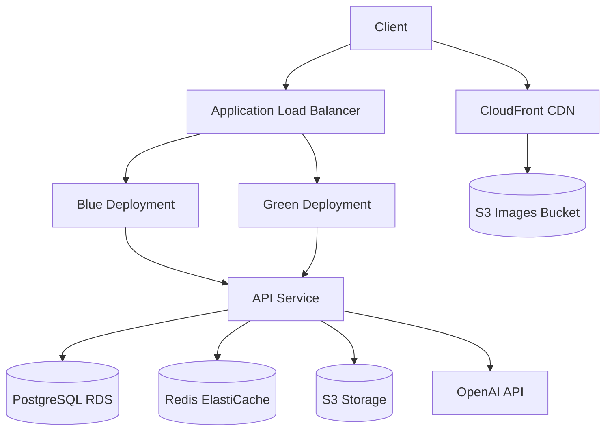

# tarot api

[](https://github.com/yourusername/tarot_api/actions/workflows/ci.yml)
[](https://github.com/yourusername/tarot_api/actions/workflows/pulumi-deploy.yml)
[](https://github.com/yourusername/tarot_api/actions/workflows/preview-environments.yml)
[](https://github.com/yourusername/tarot_api/actions/workflows/security-scan.yml)
[](https://github.com/yourusername/tarot_api/actions/workflows/cleanup-previews.yml)


a ruby on rails api for tarot card reading and interpretation, leveraging openai technologies.

## overview

this api provides endpoints for tarot card readings, user management, and ai-powered interpretations. it is designed to be scalable, secure, and user-friendly.

## infrastructure

this project uses aws infrastructure deployed via pulumi to provide a scalable, reliable application environment.

### technology stack

- **ruby on rails 8**: a web-application framework that includes everything needed to create database-backed web applications according to the model-view-controller (mvc) pattern.
- **postgresql**: a powerful, open source object-relational database system.
- **redis**: an in-memory data structure store, used as a database, cache, and message broker.
- **docker**: for containerization and consistent environments across development, staging, and production.
- **pulumi**: infrastructure as code tool for aws resource provisioning.
- **aws**: cloud infrastructure provider (ecs, rds, elasticache, s3, cloudfront, route53).

### system architecture

the application follows a microservices architecture with:

- web api layer handling http requests
- business logic layer implementing core functionality
- data persistence layer for storage
- background job processing for async tasks
- ai integration layer for openai/llm interactions



### infrastructure as code (pulumi)

this project uses pulumi for infrastructure provisioning. the infrastructure is defined in the `infra/pulumi` directory with yaml configuration files:

- `Pulumi.yaml` - main project configuration
- `network.yaml` - vpc, subnets, security groups
- `database.yaml` - rds instance for postgresql
- `cache.yaml` - elasticache for redis
- `storage.yaml` - s3 buckets and cloudfront cdn
- `dns.yaml` - route53 for domain management
- `ecs.yaml` - container orchestration and load balancing

### environments

the project supports multiple deployment environments:

- **production**: high-availability, production-grade environment
- **staging**: pre-production environment for testing, with cost-saving features
- **preview**: temporary environments for feature testing, automatically cleaned up when inactive

### deployment workflow

deployments are handled via github actions workflows:

1. **staging deployment**: automatically triggered when code is merged to the main branch
2. **preview environments**: created when a branch is tagged with `preview-*`
3. **production deployment**: triggered when a version tag (`v*`) is created or through manual approval

### zero-downtime deployments

the system uses blue-green deployment strategy for zero-downtime updates:

1. new version (green) is deployed alongside the existing version (blue)
2. health checks verify the new version is healthy
3. traffic is gradually shifted from blue to green
4. once all traffic is on green, blue can be updated for the next deployment

### cost optimization

the infrastructure includes several cost-saving measures:

- staging and preview environments scale down to zero during non-business hours
- resource sizes are optimized for each environment
- preview environments are automatically cleaned up when inactive for more than 3 days

### domain management

the domain `tarotapi.cards` is managed through aws route53:

- domain registration is handled via rake task: `rake pulumi:register_domain`
- domain protection is enabled to prevent accidental deletion: `rake pulumi:protect_domain`
- ssl certificates are automatically provisioned and renewed

### getting started with infrastructure

#### prerequisites

- aws account with appropriate permissions
- aws cli configured with access credentials
- pulumi cli installed
- ruby 3.4+

#### initial setup

1. initialize the pulumi project:

```sh
bundle exec rake pulumi:init
```

2. set required secrets:

```sh
bundle exec rake pulumi:set_secrets[staging]
```

3. deploy the staging environment:

```sh
bundle exec rake pulumi:deploy[staging]
```

#### common tasks

create a preview environment:

```sh
bundle exec rake pulumi:create_preview[feature-name]
```

list all preview environments:

```sh
bundle exec rake pulumi:list_previews
```

deploy to production (with confirmation):

```sh
bundle exec rake pulumi:deploy_production
```

cleanup inactive preview environments:

```sh
bundle exec rake pulumi:cleanup_previews
```

view infrastructure outputs:

```sh
bundle exec rake pulumi:info[environment]
```

register the domain:

```sh
bundle exec rake pulumi:register_domain
```

protect the domain from accidental deletion:

```sh
bundle exec rake pulumi:protect_domain
```

## development

### prerequisites

- ruby 3.4.0
- postgresql 16
- redis 7
- docker and docker compose
- node.js and yarn

### setup

1. clone the repository
```bash
git clone https://github.com/yourusername/tarot_api.git
cd tarot_api
```

2. install dependencies
```bash
bundle install
```

3. setup environment variables
```bash
cp .env.example .env
```
edit `.env` with your configuration

4. setup development environment
```bash
bundle exec rake dev:setup
```

5. start the server
```bash
bundle exec rake dev
```

### common development tasks

```bash
# start development environment with docker
bundle exec rake dev

# open rails console
bundle exec rake dev:console

# run tests
bundle exec rake dev:test

# view logs
bundle exec rake dev:logs

# rebuild all containers
bundle exec rake dev:rebuild
```

### running tests

```bash
bundle exec rails test
# or
bundle exec rspec
# or
bundle exec cucumber
```

### linting and style

```bash
bundle exec rubocop
```

## deployment

this project can be deployed to aws using pulumi for infrastructure as code:

### prerequisites

1. aws account and credentials
2. docker registry access
3. pulumi installed (`gem install pulumi`)
4. ssh access to deployment servers

### deployment commands

```bash
# set up servers for deployment
bundle exec rake deploy:setup

# deploy to staging
bundle exec rake deploy

# deploy to production
bundle exec rake deploy:production

# deploy a preview environment
bundle exec rake deploy:preview[branch-name]

# check deployment status
bundle exec rake deploy:status

# destroy an environment
bundle exec rake deploy:destroy[environment-name]
```

### dependabot configuration

the project is configured with special handling for dependabot pull requests:

- preview environments are not created for dependabot prs
- ci runs limited tests for dependabot prs (only security and linting checks)
- full test suites are skipped for dependabot to speed up dependency updates
- minor and patch updates are automatically merged when ci passes
- major version updates require manual review

configuration:
- `.github/dependabot.yml`: controls update frequency and versioning strategy
- `.github/workflows/dependabot-auto-merge.yml`: handles auto-merging of safe updates

this helps reduce infrastructure costs and ci pipeline usage while still maintaining security checks.

### data management

```bash
# seed database with tarot card data
bundle exec rake seed

# backup database
bundle exec rake data:backup

# restore from backup
bundle exec rake data:restore[filename]

# analyze database performance
bundle exec rake data:analyze
```

## api endpoints

the api follows jsonapi specification and includes the following main endpoints:

- `/api/v1/readings` - tarot readings
- `/api/v1/cards` - tarot card information
- `/api/v1/spreads` - tarot spread layouts
- `/api/v1/users` - user management
- `/api/v1/auth` - authentication

see the swagger documentation for details: `/api-docs`

## license

this project is licensed under the mit license - see the license file for details.

## api features

### streaming responses

Paid subscribers can receive streaming responses for tarot reading interpretations:

```bash
# Request a streaming interpretation
curl -X POST \
  "https://api.tarotapi.cards/api/v1/readings/[reading_id]/interpret_streaming" \
  -H "Authorization: Bearer [token]" \
  -H "Content-Type: application/json" \
  -H "X-Stream-Response: true" \
  -d '{"birth_date": "1990-01-01", "name": "John Doe"}'
```

The streaming response will be delivered as Server-Sent Events (SSE), with each chunk of the interpretation arriving as it's generated. This provides a more interactive and engaging experience for users.

**Requirements:**
- User must have an active paid subscription
- The `X-Stream-Response: true` header must be set
- Client must handle SSE format responses

**Client-side implementation:**
```javascript
// Connect to SSE stream
const eventSource = new EventSource('/api/v1/readings/[reading_id]/interpret_streaming');

// Handle incoming interpretation chunks
eventSource.addEventListener('interpretation', (event) => {
  const data = JSON.parse(event.data);
  console.log(data.chunk); // Append this chunk to your UI
});

// Handle connection open
eventSource.onopen = () => {
  console.log('Connection to stream established');
};

// Handle errors
eventSource.onerror = (error) => {
  console.error('EventSource error:', error);
  eventSource.close();
};

// Close the connection when done
function closeConnection() {
  eventSource.close();
}
```

For free users or when streaming is not requested, the standard interpretation endpoint is used:
```bash
# Standard interpretation request
curl -X POST \
  "https://api.tarotapi.cards/api/v1/readings/[reading_id]/interpret" \
  -H "Authorization: Bearer [token]" \
  -H "Content-Type: application/json" \
  -d '{"birth_date": "1990-01-01", "name": "John Doe"}'
```

## domain and environment setup

the project is configured to deploy to the following domains:

- **production**: https://tarotapi.cards
- **staging**: https://staging.tarotapi.cards
- **preview environments**: https://preview-[feature-name].tarotapi.cards

this domain structure is configured through:

1. **github environments**: defined in `.github/environments/` directory
2. **pulumi infrastructure**: configured in `infra/pulumi/dns.yaml`
3. **github actions**: workflows in `.github/workflows/`

for more details, see the [pulumi guide](docs/pulumi-guide.md) and [github secrets guide](docs/github-secrets-guide.md).
