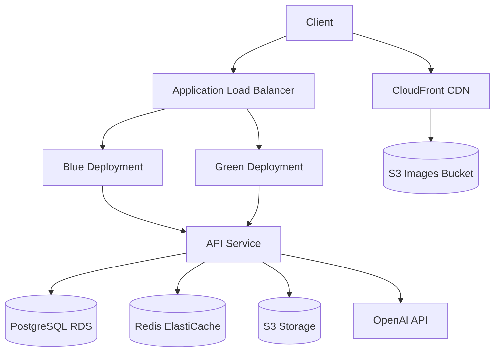

# Tarot API

[](https://github.com/abdul-hamid-achik/tarotapi/actions/workflows/ci.yml)
[](https://github.com/abdul-hamid-achik/tarotapi/actions/workflows/pulumi-deploy.yml)
[](https://github.com/abdul-hamid-achik/tarotapi/actions/workflows/preview-environments.yml)
[](https://github.com/abdul-hamid-achik/tarotapi/actions/workflows/security-scan.yml)
[](https://github.com/abdul-hamid-achik/tarotapi/actions/workflows/cleanup-previews.yml)


A Ruby on Rails API for tarot card reading and interpretation, leveraging OpenAI technologies.

## Table of Contents
- [Quick Start](#quick-start)
- [Overview](#overview)
- [Infrastructure](#infrastructure)
- [Development](#development)
- [Deployment](#deployment)
- [API Documentation](#api-documentation)
- [Command Reference](#command-reference)
- [Contributing](#contributing)
- [Troubleshooting](#troubleshooting)
- [License](#license)
- [Connection Pooling & Health Checks](#connection-pooling--health-checks)
- [Secrets Management](#secrets-management)
- [Security](#security)
- [Monitoring Stack](#monitoring-stack)

## Quick Start

Get up and running in minutes:

```bash
# Clone the repository
git clone https://github.com/abdul-hamid-achik/tarotapi.git
cd tarotapi

# Install dependencies
bundle install

# Copy and configure environment variables
cp .env.example .env

# Set up the development environment with Docker
bundle exec rake dev:setup

# Start the API server
bundle exec rake dev

# Visit the API at http://localhost:3000
# API documentation at http://localhost:3000/docs
```

## Overview

This API provides endpoints for tarot card readings, user management, and AI-powered interpretations. It is designed to be scalable, secure, and user-friendly.

## Infrastructure

The project uses AWS infrastructure deployed via Pulumi to provide a scalable, reliable application environment. 

For detailed information about the infrastructure, see the [infrastructure/README.md](infrastructure/README.md) file.

### Technology Stack

- **Ruby on Rails 8**: A web-application framework that includes everything needed to create database-backed web applications according to the Model-View-Controller (MVC) pattern.
- **PostgreSQL**: A powerful, open source object-relational database system.
- **Redis**: An in-memory data structure store, used as a database, cache, and message broker.
- **Docker**: For containerization and consistent environments across development, staging, and production.
- **Pulumi**: Infrastructure as code tool for AWS resource provisioning.
- **Kamal**: Zero-downtime container deployments using Docker and Traefik.
- **AWS**: Cloud infrastructure provider (ECS, RDS, ElastiCache, S3, CloudFront, Route53).

### System Architecture

The application follows a microservices architecture with:

- Web API layer handling HTTP requests
- Business logic layer implementing core functionality
- Data persistence layer for storage
- Background job processing for async tasks
- AI integration layer for OpenAI/LLM interactions



### Environments

The project supports multiple deployment environments with their own domains:

- **Production**: https://tarotapi.cards
- **Staging**: https://staging.tarotapi.cards
- **Preview**: https://preview-{feature-name}.tarotapi.cards

### Deployment Workflow

Deployments are handled via GitHub Actions workflows:

1. **Staging Deployment**: Automatically triggered when code is merged to the main branch
2. **Preview Environments**: Created when a branch is tagged with `preview-*`
3. **Production Deployment**: Triggered when a version tag (`v*`) is created or through manual approval

## Development

### Prerequisites

- Ruby 3.4.0
- PostgreSQL 16
- Redis 7
- Docker and Docker Compose
- Node.js and Yarn

### Setup

1. Clone the repository
```bash
git clone https://github.com/abdul-hamid-achik/tarotapi.git
cd tarotapi
```

2. Install dependencies
```bash
bundle install
```

3. Setup environment variables
```bash
cp .env.example .env
```
Edit `.env` with your configuration

4. Setup development environment
```bash
bundle exec rake dev:setup
```

5. Start the server
```bash
bundle exec rake dev
```

### Database Naming Convention

The application follows Rails conventions for database names:

- Database names follow the pattern: `tarotapi_#{Rails.env}`
- Examples:
  - Development: `tarotapi_development`
  - Test: `tarotapi_test`
  - Staging: `tarotapi_staging`
  - Production: `tarotapi_production`

This convention is enforced throughout configuration files and you should not override it with explicit `DB_NAME` environment variables. When switching environments, the database name will automatically adjust based on the `RAILS_ENV`.

To use an alternative database connection, you can set `DATABASE_URL` which takes precedence over individual connection parameters.

### common development tasks

```bash
# start development environment with docker
bundle exec rake dev

# open rails console
bundle exec rake dev:console

# run tests
bundle exec rake dev:test

# view logs
bundle exec rake dev:logs

# rebuild all containers
bundle exec rake dev:rebuild
```

### running tests

```bash
bundle exec rails test
# or
bundle exec rspec
# or
bundle exec cucumber
```

### linting and style

```bash
bundle exec rubocop
```

## Deployment

This project can be deployed to AWS using Pulumi for infrastructure as code:

### Prerequisites

1. AWS account and credentials
2. Docker registry access
3. Pulumi installed (`gem install pulumi`)
4. SSH access to deployment servers

### Deployment Infrastructure

The project uses a hybrid approach for infrastructure management and application deployment:

1. **Pulumi**: Manages cloud infrastructure including ECR (Elastic Container Registry)
2. **Rake Tasks**: Handles application container deployments

Before deploying, you need to set up the infrastructure using Pulumi:

```bash
# Initialize Pulumi stacks
bundle exec rake infra:init

# Deploy infrastructure to staging
bundle exec rake infra:deploy[staging]

# Deploy infrastructure to production
bundle exec rake infra:deploy[production]
```

This sets up all necessary AWS resources including an ECR repository for container images. The deployment tasks will automatically retrieve the container registry URL from Pulumi outputs.

### Deployment Commands

```bash
# Set up servers for deployment
bundle exec rake deploy:setup

# Deploy to staging
bundle exec rake deploy:staging

# Deploy to production
bundle exec rake deploy:production

# Check deployment status
bundle exec rake deploy:status

# Destroy an environment
bundle exec rake infra:destroy[environment-name]
```

### Container Registry Configuration

The deployment process uses AWS ECR (Elastic Container Registry) to store container images. The ECR repository URL is automatically created and configured by Pulumi and made available as an output:

```bash
# Check the container registry URL
cd infrastructure && pulumi stack output containerRegistry
```

The deployment tasks will automatically use this URL for pushing images, but you can also set it manually in your `.env` file:

```
CONTAINER_REGISTRY=<your-aws-account-id>.dkr.ecr.<region>.amazonaws.com/tarotapi-<environment>
```

### Dependabot Configuration

the project is configured with special handling for dependabot pull requests:

- preview environments are not created for dependabot prs
- ci runs limited tests for dependabot prs (only security and linting checks)
- full test suites are skipped for dependabot to speed up dependency updates
- minor and patch updates are automatically merged when ci passes
- major version updates require manual review

configuration:
- `.github/dependabot.yml`: controls update frequency and versioning strategy
- `.github/workflows/dependabot-auto-merge.yml`: handles auto-merging of safe updates

this helps reduce infrastructure costs and ci pipeline usage while still maintaining security checks.

### data management

```bash
# seed database with tarot card data
bundle exec rake seed

# backup database
bundle exec rake data:backup

# restore from backup
bundle exec rake data:restore[filename]

# analyze database performance
bundle exec rake data:analyze
```

## API Documentation

The API follows JSONapi specification. Full OpenAPI documentation is available at `/api-docs`.

### Authentication Methods

The API supports three authentication methods:

1. **JWT Bearer Token**
```bash
# Register a new user
curl -X POST \
  "https://tarotapi.cards/api/v1/auth/register" \
  -H "Content-Type: application/json" \
  -d '{"email": "random@example.com", "password": "securepassword"}'

# Login to get JWT token
curl -X POST \
  "https://tarotapi.cards/api/v1/auth/login" \
  -H "Content-Type: application/json" \
  -d '{"email": "random@example.com", "password": "securepassword"}'
```

2. **HTTP Basic Authentication**
```bash
curl -X GET \
  "https://tarotapi.cards/api/v1/cards" \
  -H "Authorization: Basic $(echo -n 'random@example.com:password' | base64)"
```

3. **API Key Authentication**
```bash
curl -X GET \
  "https://tarotapi.cards/api/v1/cards" \
  -H "X-API-Key: your-api-key"
```

### Key Endpoints

| Endpoint | Description | Authentication Required |
|----------|-------------|-------------------------|
| `GET /api/v1/cards` | List all tarot cards | No |
| `GET /api/v1/spreads` | List available spreads | No |
| `POST /api/v1/readings` | Create a new reading | Yes |
| `GET /api/v1/readings/{id}` | Get a specific reading | Yes |

## Command Reference

### Security Checks

| Command | Description |
|---------|-------------|
| `bin/security_check` | Run comprehensive security checks on the codebase |
| `bin/security_check --ci` | Run security checks in CI mode (non-interactive) |
| `bundle exec brakeman` | Run Rails security scanner |
| `bundle exec bundle-audit check --update` | Check for vulnerable dependencies |
| `bundle exec ruby-audit check` | Check for Ruby version vulnerabilities |

### Infrastructure Management

| Command | Description |
|---------|-------------|
| `bundle exec rake infra:init` | Initialize infrastructure for staging and production |
| `bundle exec rake infra:deploy[staging]` | Deploy to staging environment |
| `bundle exec rake infra:deploy[production]` | Deploy to production environment |
| `bundle exec rake infra:create_preview[feature]` | Create preview environment |
| `bundle exec rake infra:manage_state[backup]` | Backup Pulumi state |
| `bundle exec rake infra:manage_state[restore,file]` | Restore Pulumi state from backup |

### Development Commands

| Command | Description |
|---------|-------------|
| `bundle exec rake dev:setup` | Set up development environment |
| `bundle exec rake dev` | Start development environment |
| `bundle exec rake dev:console` | Open Rails console in development |
| `bundle exec rake dev:test` | Run tests in development |
| `bundle exec rake dev:logs` | View development logs |
| `bundle exec rake dev:rebuild` | Rebuild development containers |

### Complete Environment Setup Sequence

1. Initialize Pulumi and create state bucket:
   ```bash
   bundle exec rake infra:init
   ```

2. Set up secrets for each environment:
   ```bash
   bundle exec rake infra:set_secrets[staging]
   bundle exec rake infra:set_secrets[production]
   ```

3. Deploy infrastructure:
   ```bash
   # Deploy staging first
   bundle exec rake infra:deploy[staging]
   
   # Once staging is verified, deploy production
   bundle exec rake infra:deploy[production]
   ```

4. Deploy application:
   ```bash
   bundle exec rake deploy:app:staging
   bundle exec rake deploy:app:production
   ```

### Local Workflow Testing with Act

We use [Act](https://github.com/nektos/act) to test GitHub Actions workflows locally. Our setup uses the development stage from our main `Dockerfile`.

Prerequisites:
- Docker running
- PostgreSQL running on port 5432
- Redis running on port 6379
- `.env` file with required variables

```bash
# Build the CI image (required once)
bundle exec rake ci:build_image

# Run all CI checks
bundle exec rake ci:all

# Run specific checks
bundle exec rake ci:lint  # Run linting
bundle exec rake ci:test  # Run tests
bundle exec rake ci:docs  # Generate docs
```

Common issues:
- Database errors: Check PostgreSQL is running (`docker ps`)
- Redis errors: Check Redis is running (`docker ps`)
- Build errors: Try rebuilding the CI image

For more details on Act, see the [official documentation](https://github.com/nektos/act#readme).

### Preview Environment Management

Preview environments are temporary deployments for feature testing:

- **Creation Methods**:
  1. Branch naming: Create a branch with `preview-*` prefix
  2. PR tagging: Add `preview` label to a PR
  3. Manual trigger: Use GitHub Actions workflow dispatch

- **Access Control**:
  - Only repository owner (@abdul-hamid-achik) can create preview environments
  - Dependabot PRs do not create preview environments
  - Preview URLs follow pattern: `https://preview-{feature-name}.tarotapi.cards`

- **Lifecycle**:
  - Created automatically on PR open or preview tag
  - Updated on PR synchronize
  - Cleaned up automatically:
    - When PR is closed
    - After 3 days of inactivity
    - When preview tag is removed
  - Can be recreated using `bundle exec rake deploy:preview[name]`

### Deployment Verification

After deploying to any environment, verify the setup:

1. Check infrastructure status:
   ```bash
   bundle exec rake deploy:status[environment]
   ```

2. Verify domain and SSL setup:
   ```bash
   bundle exec rake deploy:verify_ssl[environment]
   ```

3. Monitor application logs:
   ```bash
   bundle exec rake deploy:logs[environment]
   ```

## Connection Pooling & Health Checks

### Connection Pooling

The API uses optimized connection pooling for both PostgreSQL and Redis to handle high-traffic workloads in AWS Fargate:

- **PostgreSQL Connection Pool**: Automatically sized based on worker processes and thread count
- **Redis Connection Pool**: Separate pools for caching, throttling, and Sidekiq
- **Pool Monitoring**: Automatic monitoring and cleanup of idle connections

#### PostgreSQL Read Replicas

The application supports PostgreSQL read replicas through the Makara gem:

- **Primary/Replica Routing**: Automatically routes reads to replicas and writes to primary
- **Sticky Connections**: Ensures consistent reads in the same request
- **Fault Tolerance**: Automatically blacklists unavailable database instances

To enable read replicas:

```bash
# Enable replica support
export DB_REPLICA_ENABLED=true
export DB_PRIMARY_HOST=your-primary-db-host
export DB_REPLICA_HOST=your-replica-db-host

# Validate the replica setup
bundle exec rake makara:validate

# Run a load test to verify balancing
bundle exec rake makara:load_test

# Check current status
bundle exec rake makara:status
```

For PostgreSQL optimization:
```bash
# View connection pool stats
bundle exec rake db:pool:stats

# Reset connection pool
bundle exec rake db:pool:clear

# Verify connections
bundle exec rake db:pool:verify

# Optimize pool size for current environment
bundle exec rake db:pool:healthcheck
```

For production environments, consider using PgBouncer as a connection pooler in a sidecar container.

### Health Checks

Health checks are available at multiple levels with appropriate authentication:

- `/health` - Public basic health check for load balancers (no auth)
- `/health_checks` - OkComputer health checks with detailed system status (requires auth)
- `/api/v1/health/detailed` - Authenticated detailed health report (requires API authentication)
- `/api/v1/health/database` - Authenticated database status report (requires API authentication)

When using Makara replicas, additional health checks are added automatically:
- `/health_checks/db_primary_primary` - Checks the primary database 
- `/health_checks/db_replica_replica` - Checks the replica database

Protected health checks require either:
1. OkComputer auth credentials (username/password)
2. API authentication (Bearer token, Basic auth, or API key)

Set the following environment variables in production:
```
HEALTH_CHECK_USERNAME=your_secure_username
HEALTH_CHECK_PASSWORD=your_secure_password
```

## Secrets Management

This project uses Docker secrets for managing sensitive information. To set up your development environment properly:

1. Create a `secrets/` directory in the project root (not tracked by Git)
2. Add the following secret files:
   - `secrets/db_password.txt`: PostgreSQL database password
   - `secrets/jwt_secret.txt`: Secret key for JWT token generation
   - `secrets/health_check_password.txt`: Password for health check endpoints
   - `config/openai_api_key.txt`: Your OpenAI API key

3. AWS credentials are read from your `~/.aws/credentials` file. Make sure it's properly configured with:
   ```
   [default]
   aws_access_key_id = YOUR_ACCESS_KEY
   aws_secret_access_key = YOUR_SECRET_KEY
   ```

4. Never commit secret files to Git. They are excluded in `.gitignore`.

5. For production deployment, use a proper secrets management service like AWS Secrets Manager, HashiCorp Vault, or Docker Swarm secrets.

## Security

This project uses multiple security scanning tools to ensure code quality and security:

### Automated Security Scanning

Our CI/CD pipeline runs these security checks automatically:

1. **Secret Scanning** - Detects hardcoded secrets using:
   - GitLeaks - Advanced secret detection with pattern matching
   - TruffleHog - Deep scanning for secrets with verification
   - GitHub Advanced Security integration

2. **Vulnerability Scanning**:
   - Brakeman - Rails-specific vulnerability scanner
   - Bundle Audit - Dependency vulnerability scanner
   - CodeQL Analysis - GitHub's advanced SAST tool

3. **Docker Security**:
   - Dockerfile best practices checking
   - Container security scanning

### Running Security Scans Locally

```bash
# Check for Rails security vulnerabilities
bundle exec brakeman -A

# Check for vulnerable dependencies
bundle audit check --update

# Check for hardcoded secrets
git grep -i "password\|secret\|token\|key" -- ":(exclude)*.md" ":(exclude).gitignore"
```

# Deployment to production
bundle exec rake deploy:production

### New Deployment Tasks

The application uses a hybrid approach with Pulumi for infrastructure management and Kamal for application deployment. Several Rake tasks are available to facilitate this process:

```bash
# Deploy both infrastructure and application
bundle exec rake deploy:all

# Deploy only infrastructure with Pulumi
bundle exec rake deploy:pulumi

# Deploy only application with Kamal
bundle exec rake deploy:kamal

# Rollback application deployment
bundle exec rake deploy:rollback

# Destroy infrastructure (use with caution)
bundle exec rake deploy:destroy_infra

# Get database endpoint from Pulumi
bundle exec rake deploy:db_endpoint

# Get Redis endpoint from Pulumi
bundle exec rake deploy:redis_endpoint

# Get all Pulumi outputs
bundle exec rake deploy:outputs

# Generate Pulumi config file for current environment
bundle exec rake deploy:generate_config
```

Note that for Pulumi tasks, you need to set the `PULUMI_ACCESS_TOKEN` environment variable with your Pulumi access token.

### Pulumi ESC Environments

This project uses Pulumi ESC (Environments, Secrets, and Configuration) for managing configuration across different environments. ESC environments are automatically set up when you run deployment tasks, so you don't need to worry about creating them separately.

The deployment process will:
1. Check if an ESC environment exists for your current stack
2. Create one automatically if it doesn't exist
3. Configure it with appropriate settings and secrets
4. Use it for all deployments

If you want to manually work with ESC environments, these tasks are still available:

```bash
# Manually set up or update a Pulumi ESC environment
bundle exec rake deploy:setup_esc

# Convert all existing stacks to Pulumi ESC environments
bundle exec rake deploy:convert_all_to_esc
```

Using ESC environments provides several benefits:
- Consistent configuration across stacks
- Better secrets management with proper encryption of sensitive values
- Cleaner separation of environment-specific settings
- More organized configuration structure

Note that for Pulumi tasks, you need to set the `PULUMI_ACCESS_TOKEN` environment variable with your Pulumi access token, and optionally `PULUMI_ORG` to specify your organization name (defaults to "abdul-hamid-achik").

## Monitoring Stack

The project includes a comprehensive monitoring stack that can be enabled with Docker Compose profiles:

### Available Profiles

The docker-compose.yml supports several profiles for optional services:

- **monitoring**: Grafana, Loki, and Tempo for observability
- **replica**: PostgreSQL and Redis replicas for read scaling
- **ai**: Ollama for local AI model hosting

### Using the Monitoring Stack

To start the API with monitoring:

```bash
# Start the API with monitoring enabled
docker-compose --profile monitoring up

# Start everything including replicas and monitoring
docker-compose --profile monitoring --profile replica up
```

### Monitoring Components

- **Grafana**: Visualization platform at http://localhost:3001 (default login: admin/admin)
- **Loki**: Log aggregation system that captures logs from the Rails application
- **Tempo**: Distributed tracing backend for performance monitoring

### Configuring Loki

To properly send Rails logs to Loki, ensure your Rails application is configured with a compatible logger. In `config/environments/development.rb` or through a gem like `rails_semantic_logger`:

```ruby
# Example configuration for development.rb
config.log_formatter = ::Logger::Formatter.new
config.logger = ActiveSupport::TaggedLogging.new(
  Logger.new(STDOUT)
)
```

### AWS Credentials

The application uses AWS credentials for S3 access (via MinIO locally). Set these in your `.env` file:

```
AWS_ACCESS_KEY_ID=your_access_key
AWS_SECRET_ACCESS_KEY=your_secret_key
```

This configuration is used by both the API and MinIO containers.

## API Documentation